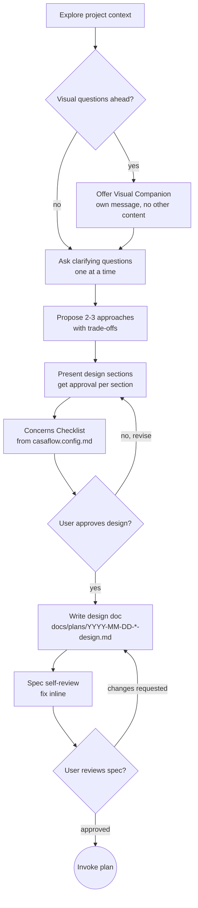

# Brainstorming Ideas Into Designs

**PURPOSE**: Turn ideas into fully formed, approved designs through natural collaborative dialogue. Explore the solution space, surface cross-cutting concerns, and get user sign-off before any code is written.

**CONFIGURATION**: Reads `casaflow.config.md` for the Concerns Checklist (maps team skills into design review) and pipeline stage overrides by work type.

---

## When to Use

Invoke this skill when:
- Creating a new feature or component
- Adding functionality to existing code
- Modifying behavior that affects users or systems
- The user says "let's design", "how should we build", "I want to add..."
- `kickoff` routes here during the BRAINSTORM stage

**Do NOT use when:**
- Fixing a bug with an obvious root cause (use `debug`)
- Running a chore or config change (skip to `plan`)
- You only need to create a PR (use `pr-create` directly)

---

<HARD-GATE>
Do NOT invoke any implementation skill, write any code, scaffold any project,
or take any implementation action until you have presented a design and the
user has approved it. This applies to EVERY project regardless of perceived
simplicity.
</HARD-GATE>

## Anti-Pattern: "This Is Too Simple To Need A Design"

Every project goes through this process. A single-function utility, a config change, a migration -- all of them. "Simple" projects are where unexamined assumptions cause the most wasted work. The design can be short (a few sentences for truly simple projects), but you MUST present it and get approval.

---

## Checklist

Complete these steps in order:

1. **Explore project context** -- check files, docs, recent commits
2. **Offer visual companion** (if topic involves visual questions) -- this is its own message, not combined with a clarifying question. See the Visual Companion section below.
3. **Ask clarifying questions** -- one at a time, understand purpose/constraints/success criteria
4. **Propose 2-3 approaches** -- with trade-offs and your recommendation
5. **Present design** -- in sections scaled to complexity, get user approval after each section
6. **Concerns Checklist** -- walk through configurable concerns from `casaflow.config.md`
7. **Write design doc** -- save to `docs/plans/YYYY-MM-DD-<topic>-design.md`
8. **Spec self-review** -- scan for placeholders, contradictions, ambiguity, scope
9. **User reviews written spec** -- ask user to review before proceeding
10. **Transition to implementation** -- invoke `plan` to create implementation plan

---

## Process Flow

**The terminal state is invoking `plan`.** Do NOT invoke any other implementation skill. The ONLY skill invoked after brainstorming is `plan`.

---

## The Process

### Understanding the Idea

- Check the current project state first (files, docs, recent commits)
- Before asking detailed questions, assess scope: if the request describes multiple independent subsystems (e.g., "build a platform with chat, file storage, billing, and analytics"), flag this immediately. Do not spend questions refining details of a project that needs to be decomposed first.
- If the project is too large for a single spec, help the user decompose into sub-projects: what are the independent pieces, how do they relate, what order should they be built? Then brainstorm the first sub-project through the normal design flow. Each sub-project gets its own spec, plan, and implementation cycle.
- For appropriately-scoped projects, ask questions one at a time to refine the idea
- Prefer multiple choice questions when possible, but open-ended is fine too
- **Only one question per message** -- if a topic needs more exploration, break it into multiple questions
- Focus on understanding: purpose, constraints, success criteria

### Exploring Approaches

- Propose 2-3 different approaches with trade-offs
- Present options conversationally with your recommendation and reasoning
- Lead with your recommended option and explain why
- Be specific about what each approach costs and gains

### Presenting the Design

- Once you believe you understand what to build, present the design
- Scale each section to its complexity: a few sentences if straightforward, up to 200-300 words if nuanced
- Ask after each section whether it looks right so far
- Cover: architecture, components, data flow, error handling, testing approach
- Be ready to go back and clarify if something doesn't make sense

### Design for Isolation and Clarity

- Break the system into smaller units that each have one clear purpose, communicate through well-defined interfaces, and can be understood and tested independently
- For each unit, you should be able to answer: what does it do, how do you use it, and what does it depend on?
- Can someone understand what a unit does without reading its internals? Can you change the internals without breaking consumers? If not, the boundaries need work.
- Smaller, well-bounded units are easier for AI agents to work with -- they reason better about code they can hold in context at once, and edits are more reliable when files are focused.

### Working in Existing Codebases

- Explore the current structure before proposing changes. Follow existing patterns.
- Where existing code has problems that affect the work (e.g., a file that has grown too large, unclear boundaries, tangled responsibilities), include targeted improvements as part of the design.
- Do not propose unrelated refactoring. Stay focused on what serves the current goal.

---

## Concerns Checklist (Configurable)

Read the `## Concerns Checklist` section from `casaflow.config.md`. Walk through each concern defined there. Mark N/A if it does not apply -- but **explicitly mark it**, do not skip silently.

For each concern:
- If marked **Yes** and mapped to a skill -> load that skill for guidance
- If marked **Yes** and mapped to a specialist -> note the specialist's domain
- If marked **Yes** and mapped to `manual` -> flag for human review
- If marked **No** or **N/A** -> record the decision with brief rationale

Present the checklist results to the user as part of the design review. Each "Yes" adds scope to the plan -- the user should explicitly approve the added scope.

**If no concerns checklist is configured**, use the minimal defaults:
- Error handling
- Security
- Test strategy

See `framework/CONCERNS_CHECKLIST.md` for full documentation on checklist configuration and work type behavior.

---

## After the Design

### Write the Design Document

Save to: `docs/plans/YYYY-MM-DD-<topic>-design.md`

The design document should include:
- Problem statement
- Approved approach (with rationale)
- Architecture and component breakdown
- Data flow
- Error handling strategy
- Test strategy
- Concerns checklist results
- Any open questions or deferred decisions

### Spec Self-Review

After writing the spec document, review it with fresh eyes:

1. **Placeholder scan:** Any "TBD", "TODO", incomplete sections, or vague requirements? Fix them.
2. **Internal consistency:** Do any sections contradict each other? Does the architecture match the feature descriptions?
3. **Scope check:** Is this focused enough for a single implementation plan, or does it need decomposition?
4. **Ambiguity check:** Could any requirement be interpreted two different ways? If so, pick one and make it explicit.

Fix any issues inline. No need to re-review -- just fix and move on.

### User Review Gate

After the self-review passes, ask the user to review the written spec before proceeding:

> "Spec written to `<path>`. Please review it and let me know if you want to make any changes before we start writing the implementation plan."

Wait for the user's response. If they request changes, make them and re-run the self-review. Only proceed once the user approves.

### Transition to Implementation

- **REQUIRED**: Invoke `plan` to create a detailed implementation plan
- Do NOT invoke any other skill. `plan` is the next step.

---

## Visual Companion

A browser-based companion for showing mockups, diagrams, and visual options during brainstorming. Available as a tool -- not a mode. Accepting the companion means it is available for questions that benefit from visual treatment; it does NOT mean every question goes through the browser.

**Offering the companion:** When you anticipate that upcoming questions will involve visual content (mockups, layouts, diagrams), offer it once for consent:

> "Some of what we're working on might be easier to explain if I can show it to you in a web browser. I can put together mockups, diagrams, comparisons, and other visuals as we go. This feature is still new and can be token-intensive. Want to try it? (Requires opening a local URL)"

**This offer MUST be its own message.** Do not combine it with clarifying questions, context summaries, or any other content. Wait for the user's response before continuing. If they decline, proceed with text-only brainstorming.

**Per-question decision:** Even after the user accepts, decide FOR EACH QUESTION whether to use the browser or the terminal. The test: **would the user understand this better by seeing it than reading it?**

- **Use the browser** for content that IS visual -- mockups, wireframes, layout comparisons, architecture diagrams, side-by-side visual designs
- **Use the terminal** for content that is text -- requirements questions, conceptual choices, tradeoff lists, scope decisions

A question about a UI topic is not automatically a visual question. "What does personality mean in this context?" is a conceptual question -- use the terminal. "Which layout works better?" is a visual question -- use the browser.

---

## Key Principles

- **One question at a time** -- do not overwhelm with multiple questions
- **Multiple choice preferred** -- easier to answer than open-ended when possible
- **YAGNI ruthlessly** -- remove unnecessary features from all designs
- **Explore alternatives** -- always propose 2-3 approaches before settling
- **Incremental validation** -- present design, get approval before moving on
- **Be flexible** -- go back and clarify when something doesn't make sense

---

## Integration

**Called by:**
- `kickoff` during the BRAINSTORM stage

**Terminal state:**
- **REQUIRED**: Invoke `plan` to create implementation plan

**Related skills:**
- `prd` -- for capturing formal product requirements before brainstorming
- `plan` -- the next step after design approval

---

## Common Mistakes

| Mistake | Consequence | Fix |
|---------|------------|-----|
| Skipping design for "simple" projects | Unexamined assumptions, wasted rework | Design can be short, but it must exist |
| Multiple questions per message | User overwhelmed, answers incomplete | One question at a time, always |
| Jumping to implementation before approval | Building the wrong thing | Hard gate: no code until design approved |
| Skipping Concerns Checklist | Missing cross-cutting concerns discovered late | Walk through every concern, mark N/A explicitly |
| Writing vague design sections | Ambiguous requirements lead to wrong implementation | Scale sections to complexity, be specific |
| Not decomposing large projects | Unmanageable scope, spec too broad | Flag multi-subsystem projects, decompose first |
| Skipping user review of written spec | Misunderstandings baked into the plan | Always ask user to review before proceeding |
