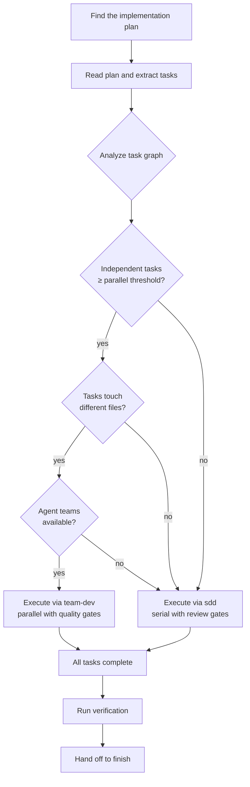

# Build

**PURPOSE**: Execute an implementation plan. Analyzes the task graph, picks the right execution strategy (parallel or serial), and runs it with quality gates. You hand it a plan — it builds the thing.

**CONFIGURATION**: Reads `casaflow.config.md` for `parallel-threshold`, `default-strategy`, and `teammate-mode`.

---

## When to Use

- "Build this", "execute the plan", "let's build", "implement this"
- After `brainstorm` → `plan` produces an implementation plan
- When you have a plan file in the vault or at `docs/plans/*.md` and want to execute it
- When you're not sure whether to use `team-dev` or `sdd`

**You don't need to know the difference between parallel and serial execution.** This skill figures it out.

---

## Process



### Step 1: Find the Plan

Look for the implementation plan in this order:

1. **User provided it** — they said "build this plan" with a file path
2. **Vault plan** — if `vault-path` and `project-name` are configured in
   `casaflow.config.md`, look for
   `<vault-path>/<project-name>/<feature-slug>/plan.md`
3. **Legacy location** — scan `docs/plans/` for the newest `*-plan.md` file
4. **Current conversation** — a plan was created earlier in this session
5. **Ask** — if no plan found, ask the user. Suggest running `plan` first.

### Step 2: Read and Analyze

Read the plan file. Extract:

- **All tasks** with their full text, file paths, and dependencies
- **Dependency graph** — which tasks block which (`blockedBy` relationships)
- **File surface area** — which files each task touches
- **Task count** — total number of tasks
- **Independent tasks** — tasks with no unresolved blockers at the start

### Step 3: Choose Execution Strategy

Read `casaflow.config.md` for:
- `parallel-threshold` (default: 3) — minimum independent tasks for parallel
- `default-strategy` (default: team-dev) — preference when conditions are met
- `teammate-mode` (default: tmux) — how parallel agents appear

**Decision logic:**

| Condition | Strategy | Why |
|-----------|----------|-----|
| < threshold independent tasks | `sdd` (serial) | Not enough parallelism to justify team overhead |
| ≥ threshold but tasks share files | `sdd` (serial) | File conflicts make parallel unsafe |
| ≥ threshold, different files, teams available | `team-dev` (parallel) | Full parallel execution with quality gates |
| ≥ threshold, different files, teams NOT available | `sdd` (serial) | Fallback — suggest enabling agent teams |
| Only 1-2 tasks total | Direct execution | No orchestrator needed — just do it |

**Announce the decision:**

> "This plan has N tasks. M are independent and touch different files. Using **team-dev** (parallel execution with quality gates)."

or

> "This plan has N tasks but they're tightly coupled (shared files / sequential dependencies). Using **sdd** (serial execution with review gates)."

or

> "This plan has 2 tasks. Executing directly — no orchestrator needed."

### Step 4: Execute

**If parallel (team-dev):**
Invoke the `team-dev` skill with the full plan. It handles:
- Spawning implementer teammates in split panes
- Staggered spec compliance + code quality reviews
- Task dependency management
- Dynamic implementer reuse/replacement

**If serial (sdd):**
Invoke the `sdd` skill with the full plan. It handles:
- Fresh subagent per task
- Two-stage review after each (spec compliance then code quality)
- Sequential task execution respecting dependencies

**If direct (1-2 tasks):**
Execute tasks inline in the current session:
1. Implement task 1
2. Run tests, verify
3. Implement task 2 (if exists)
4. Run tests, verify
5. Self-review

### Step 5: Verify and Finish

After all tasks complete (regardless of strategy):

1. **Run verification** — use `verify` to confirm everything works:
   - Project builds
   - All tests pass
   - No linting errors

2. **Hand off to `finish`** — which presents options:
   - Merge locally
   - Create PR (via `pr-create`)
   - Keep branch as-is
   - Discard

---

## PRD Integration

If the plan references a PRD (`> **PRD:** docs/plans/...`), the spec reviewers in both `team-dev` and `sdd` will automatically load the PRD's acceptance checklist and verify each `[ ]` item against the implementation. You don't need to do anything extra — the link in the plan header is enough.

---

## When Things Go Wrong

| Situation | Action |
|-----------|--------|
| No plan found | Ask the user. Suggest `/casaflow:plan` to create one. |
| Plan has no tasks | The plan is incomplete. Ask the user to review it. |
| Agent teams not available for parallel | Fall back to serial. Note: "Agent teams aren't enabled. Using serial execution. To enable: add `CLAUDE_CODE_EXPERIMENTAL_AGENT_TEAMS: "1"` to settings." |
| Task fails review repeatedly | The strategy handles this (team-dev sends feedback, sdd re-reviews). If 3+ review cycles fail, escalate to the user. |
| Build/tests fail after all tasks | Don't hand off to finish. Fix the issues first, re-verify. |
| Scope changed mid-build | Pause. Ask: "The implementation is diverging from the plan. Should we update the plan or continue?" |

---

## Integration

**Called by:**
- `kickoff` during the EXECUTE stage
- Users directly via `/casaflow:build`

**Invokes:**
- `team-dev` — for parallel execution
- `sdd` — for serial execution
- `verify` — after all tasks complete
- `finish` — to complete the branch

**Related:**
- `plan` — creates the plan that this skill executes
- `prd` — produces acceptance checklists that spec reviewers verify during execution
- `kickoff` — the full pipeline orchestrator that routes here at the EXECUTE stage

---

## Quick Reference

```
/casaflow:build              "Here's a plan, build it"
                              │
                    ┌─────────┴──────────┐
                    │  Analyze task graph │
                    └─────────┬──────────┘
                              │
              ┌───────────────┼───────────────┐
              │               │               │
         ≥ threshold    < threshold      1-2 tasks
         + diff files   or shared files
              │               │               │
         team-dev           sdd          direct
         (parallel)      (serial)       (inline)
              │               │               │
              └───────────────┼───────────────┘
                              │
                    ┌─────────┴──────────┐
                    │  verify → finish   │
                    └────────────────────┘
```
