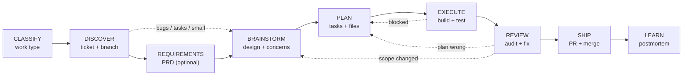
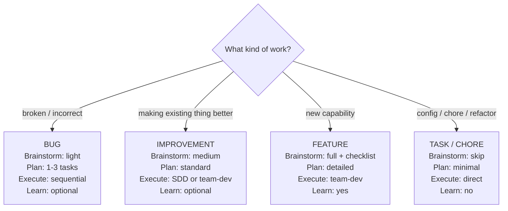
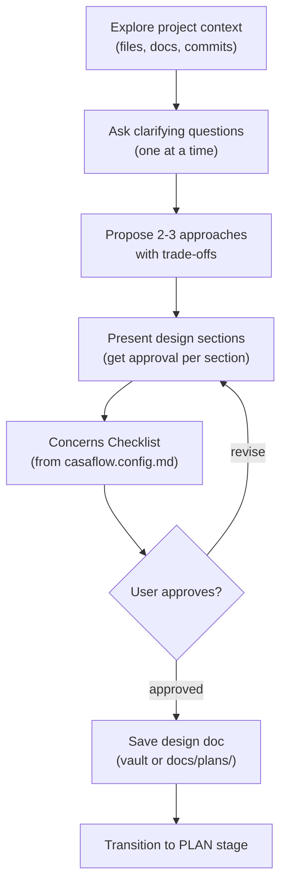
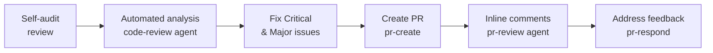

# Jig Development Pipeline

**PURPOSE**: The pipeline orchestrator. Ensures every task — bug, feature, improvement, or chore — flows through a predictable sequence of stages with quality checks at each transition.

**CONFIGURATION**: Reads `casaflow.config.md` for pipeline stages, work type overrides, ticket system, branching format, and concerns checklist.

---

## When to Use

Invoke this skill when:
- Starting development work of any kind
- "I need to add/fix/build/improve..."
- "Let's work on [ticket]"
- "There's a bug in..."
- Beginning a new session with a development task
- You want the full pipeline, not just one stage

**Do NOT use when** you only need a single stage (e.g., just creating a PR → use `pr-create` directly).

---

## Terminology

| Term | Meaning |
|------|---------|
| **SDD** | Subagent-Driven Development (`sdd`) — sequential execution, one task at a time |
| **Team-dev** | `team-dev` — parallel execution with agent teams in split panes + two-stage quality gates |

## The Pipeline



Each stage has a **gate**. You don't move forward until the gate is satisfied.

The pipeline stages and work type overrides are configurable in `casaflow.config.md`. Read the config at the start of each session to determine which stages to run.

---

## Step 1: Classify the Work

Before anything else, determine the work type. This controls pipeline depth.



Check `casaflow.config.md` for stage overrides per work type. The config may skip or lighten stages beyond these defaults.

Ask the user if the type isn't obvious from context.

---

## Step 2: DISCOVER

**Gate**: A ticket exists and the problem is understood.

### Pre-fetched context check

If ticket context and work type were provided by a prior skill in this
conversation (e.g., a spec skill detected a Bug and handed off with ticket
details), **use that context directly**:
- Do not re-ask for the ticket ID
- Do not re-fetch from the ticket system
- Mark the ticket gate as satisfied
- Proceed directly to branch setup (step 3 below)

If no pre-fetched context exists, follow the normal flow:

### Actions

1. **Check for existing ticket**:
   - Branch name contains a ticket reference? Look it up.
   - User mentioned a ticket? Fetch it.
   - No ticket? Create one. Check `casaflow.config.md` for `ticket-system` (Linear, Jira, GitHub Issues) and use the appropriate tool.

2. **Understand the problem**:
   - Read the ticket description and acceptance criteria.
   - For bugs: check error tracking, reproduce if possible.
   - For features: confirm scope with the user if ambiguous.

3. **Set up the branch**:
   Read the `## Branching` section from `casaflow.config.md`. If the config
   provides type-aware formats (e.g., `feature`, `fix`, `default`), select
   the format matching the work type:
   - `feature` format for features and improvements
   - `fix` format for bugs
   - `default` format for tasks and chores

   Interpolate `{ticket-id}` from the ticket key and `{kebab-title}` from
   the slugified work description. If no ticket ID is available, omit it
   from the branch name.

   If the config uses a single `format` string (legacy), use that directly:
   ```bash
   git checkout -b {format from config}
   ```

### Gate Check

Before proceeding, confirm:
- [ ] Ticket exists with clear acceptance criteria
- [ ] Branch follows the team's naming convention
- [ ] Problem is understood (not just the title — the actual problem)

---

## Step 2b: REQUIREMENTS (optional)

**Gate**: PRD exists or user opted to skip.

For **features** and **large improvements**, prompt: "Want to capture requirements first with `/prd`?"

If yes, invoke `prd` to produce a structured PRD with enforceable acceptance checklists. The PRD becomes the input to brainstorming — it defines *what* needs to be built so brainstorming can focus on *how*.

For **bugs**, **tasks**, and **small improvements**: skip this step. Users can still invoke `/prd` manually if needed.

### Gate Check

- [ ] PRD saved (vault: `<vault-path>/<project-name>/<feature-slug>/prd.md`, or fallback: `docs/plans/YYYY-MM-DD-<topic>-prd.md`) OR user opted to skip
- [ ] If PRD exists, acceptance checklist has `[ ]` items tagged by layer

---

## Step 3: BRAINSTORM

**Gate**: A design is approved by the user.

### For Bugs (light)

Focus on:
1. **Root cause**: What's actually broken and why?
2. **Fix approach**: What's the minimal change that fixes it?
3. **Regression risk**: What could this fix break?
4. **Test plan**: How do we verify the fix and prevent regression?

### For Improvements (medium)

Run `brainstorm` with these additions:
1. **Existing patterns**: How does the current implementation work?
2. **2-3 approaches**: What are the options with trade-offs?
3. **Concerns checklist**: Run the configurable checklist (see below).

### For Features (full)



Run `brainstorm` with the project's Concerns Checklist:

#### Concerns Checklist (Configurable)

Read the `## Concerns Checklist` section from `casaflow.config.md`. Walk through each concern defined there. Mark N/A if it doesn't apply — but **explicitly mark it**, don't skip silently.

For each concern:
- If marked **Yes** and mapped to a skill → load that skill for guidance
- If marked **Yes** and mapped to `manual` → flag for human review
- If marked **No** or **N/A** → record the decision

Present the checklist results to the user as part of the design review. Each "Yes" adds scope to the plan — the user should explicitly approve.

**If no concerns checklist is configured**, use the minimal defaults:
- Error handling
- Security
- Test strategy

### For Tasks/Chores

Skip brainstorming. Move directly to Plan.

### Gate Check

Before proceeding, confirm:
- [ ] Design is reviewed and approved by the user
- [ ] Concerns checklist completed (features/improvements)
- [ ] Design doc saved (vault: `<vault-path>/<project-name>/<feature-slug>/design.md`, or fallback: `docs/plans/YYYY-MM-DD-<topic>-design.md`)

---

## Step 4: PLAN

**Gate**: A numbered plan exists with tasks, files, and verification steps.

Invoke `plan` to produce the implementation plan.

### Plan Requirements

Every plan must include:
- **Numbered tasks** scoped to 2-5 minutes each
- **File paths** per task (create vs modify)
- **Skill references** per task (which domain/feature skills apply)
- **Dependency relationships** (`blockedBy` for sequential tasks)
- **Verification steps** per task (how to confirm it works)
- **Commit message** per task (following the project's commit convention)

### Plan Output

Save to the feature directory in the vault if `vault-path` is configured:
`<vault-path>/<project-name>/<feature-slug>/plan.md`

**Fallback**: `docs/plans/YYYY-MM-DD-<topic>-plan.md`

The plan header should include:

> **PRD:** `<feature-dir>/prd.md` *(include if a PRD exists)*
> **For Claude:** Use `build` to execute this plan (auto-selects parallel or serial).

The `> **PRD:**` line is how downstream spec reviewers find the acceptance checklist. Always include it when a PRD was created in the REQUIREMENTS step.

### Gate Check

Before proceeding, confirm:
- [ ] Plan reviewed and approved by the user
- [ ] Tasks have clear file paths and skill references
- [ ] Dependencies identified (which tasks block which)
- [ ] Plan saved (vault or `docs/plans/`)

---

## Step 5: EXECUTE

**Gate**: All tasks implemented, tested, and committed.

Invoke `build` with the plan. It analyzes the task graph and automatically picks the right execution strategy:

- **Parallel** (`team-dev`) — when 3+ independent tasks touch different files and agent teams are available
- **Serial** (`sdd`) — when tasks are coupled, share files, or agent teams aren't available
- **Direct** — for 1-2 simple tasks, no orchestrator needed

You don't need to choose. `build` reads `casaflow.config.md` for `parallel-threshold` and `default-strategy`, inspects the plan, and routes accordingly.

### Gate Check

Before proceeding, confirm:
- [ ] All tasks from the plan are implemented
- [ ] Tests pass (as specified in plan)
- [ ] Changes committed with proper messages
- [ ] Project builds successfully

---

## Step 6: REVIEW

**Gate**: Code passes self-audit and automated review.



### Self-Audit First

Run the pre-commit review via `review`. This dispatches the specialist swarm to catch common issues:
- Dead code and unused references
- Security vulnerabilities
- Error handling gaps
- Async safety issues
- Performance problems
- Plus any team-specific specialists

### Automated Review

1. Run `code-review` agent — produces a review report with severity ratings
2. Fix any Critical or Major issues identified
3. After PR creation, run `pr-review` agent for inline comments

### Gate Check

Before proceeding, confirm:
- [ ] Self-audit checklist passed
- [ ] No Critical issues in review report
- [ ] All Major issues addressed or acknowledged

---

## Step 7: SHIP

**Gate**: PR created and merged.

1. **Commit**: use the `commit` agent
2. **Create PR**: `/pr-create` — analyzes branch, writes description, creates PR
3. **Address feedback**: `/pr-respond` for any reviewer comments
4. **Merge**: After approval

### Gate Check

- [ ] PR created with clear description
- [ ] Ticket referenced (per `casaflow.config.md` settings)
- [ ] CI passes
- [ ] Reviewer approval received

---

## Step 8: LEARN (features only, optional for others)

After merge, invoke `/postmortem` to:
- Analyze reviewer comments for patterns
- Identify gaps in existing skills
- Update skills or review configs based on findings

This closes the feedback loop. Skills improve over time.

---

## Stage Transitions

The pipeline enforces ordering. Here's the complete transition map:

```
CLASSIFY
  └──> DISCOVER (always)
         ├──> REQUIREMENTS (features, large improvements — optional)
         │    └──> BRAINSTORM
         │
         ├──> BRAINSTORM (bugs, small improvements — skip requirements)
         │    └──> PLAN (always after brainstorm)
         │
         └──> PLAN (tasks/chores skip brainstorm + requirements)
                └──> EXECUTE (always)
                       └──> REVIEW (always)
                              └──> SHIP (always)
                                     └──> LEARN (features, complex improvements)
```

### Looping Back

The pipeline isn't strictly linear. You may loop back when:

- **Plan is wrong** → Return to Plan, revise tasks
- **Scope changed during execution** → Return to Brainstorm, update design
- **Review finds design issues** → Return to Plan or Brainstorm depending on severity
- **PR feedback requires significant changes** → Return to Execute

When looping back, update the plan document to reflect changes.

---

## Common Mistakes

| Mistake | Consequence | Fix |
|---------|------------|-----|
| Skipping Discover | No ticket, no branch convention, no tracking | Always start with the ticket |
| Skipping Requirements for features | Vague scope, acceptance criteria discovered mid-implementation | Run `/prd` before brainstorming |
| Skipping Brainstorm | Missing cross-cutting concerns | Run the Concerns Checklist |
| Skipping Plan for "simple" features | Can't parallelize, ad-hoc execution | Even 2-task plans help |
| Skipping Review | AI-generated bugs ship to production | Self-audit is non-negotiable |
| Skipping Learn | Same review feedback on every PR | Run postmortem on complex features |
| Starting with code | "Add a button" without understanding the requirement | Discover first, always |
| Planning without brainstorming | Plan misses cross-cutting concerns | Design before decomposing |

---

## Quick Reference

| Stage | Invoke | Output |
|-------|--------|--------|
| Classify | (automatic in this skill) | Work type determined |
| Discover | Ticket system integration | Ticket + branch |
| Requirements | `prd` (optional) | PRD with acceptance checklist |
| Brainstorm | `brainstorm` + concerns checklist | Approved design |
| Plan | `plan` | `docs/plans/*.md` |
| Execute | `build` (routes to `team-dev` or `sdd`) | Implemented + tested code |
| Review | `review` → `code-review` agent | Audited code |
| Ship | `commit` → `pr-create` | Merged PR |
| Learn | `postmortem` | Updated skills |
